```mermaid
flowchart RL
    P("Untrusted Video Player ❌")
    VC("Valuable Content 💰")
    VC --> P
```

```mermaid
flowchart RL
    P("Trusted Video Player ✅")
    VC("Valuable Content 💰")
    VC --> P
```

```mermaid
flowchart RL
    P("Trusted Video Player ✅")
    VC("Valuable Content 💰")
    D("<p style='font-size: 60px; margin-block-start: 0.5em'>😈🎥</p>")
    VC --> P --> D
```

# An unbuffered tale of my first year in video streaming

background from [unsplash/KOBU Agency](https://unsplash.com/photos/4H67yWXO2-M)

---
layout: section
transition: slide-up
---

# What to expect 👀

<!-- 
- About engineering in video streaming, not content production
-->

---
layout: section
transition: slide-left
---

# Shameless plug for Spekky Bandit Gaming

[Videos on Youtube](https://www.youtube.com/@spekkybanditgaming)

<!-- 
Couldn't be here tonight as he's too busy playing games
-->

---
layout: statement
transition: slide-down
---

- ## My journey to video streaming 🚗
- ## Video streaming 101 🎓
- ## The challenges & Solutions 🚀

<!-- 
Who am I and how did I get to working in video streaming?
Not just talk about technical challenges, but forming a team and working with third parties. 
Not specific to current client
Talk through the solutions
-->

---
layout: section
transition: slide-left
---

# My Journey 🚗

---
layout: statement
transition: slide-left
---

## Healthcare Software 🚑

<!-- 
- Vertical scaling
- Low level engineering, performance tuning
- More transactions than visa
- Speeding up releases to go international
-->

---
layout: statement
transition: slide-left
---

## Banking Software 💰

<!--
- Open Banking - OAuth, security, k8s
-->
---
layout: statement
transition: slide-left
---

## Logistics Software 🚢

<!--
- Event driven architecture
-->

---
layout: statement
transition: slide-left
---

## Video Streaming 🎥

<!--
- Wanted to go back to apps with scale
- Get to know the tech really well
-->
---
layout: section
transition: slide-up
---

# Video Streaming 101 🎓

(live streaming)

<!--
Look at live streaming as it's more challenging
-->

---
layout: statement
transition: slide-left
---

<!--
 - Illusion of continuity
-->

---
layout: quote
transition: slide-left
---

## 1 million streams at 5 Mbit/s
$$
\begin{split}
  &= 1,000,000 × 5,000,000 \space\footnotesize bit/s \\
  &= 5,000,000,000,000 \space\footnotesize bit/s \\
  &\huge= 5 \space\normalsize Tbit/s
\end{split}
$$

---
layout: statement
transition: slide-left
---

^^^ [ChatGPT](https://chat.openai.com/)

---
layout: statement
transition: slide-left
---

^^^ [ChatGPT](https://chat.openai.com/)

---
layout: statement
transition: slide-left
---

<!--
 - But can use http and so CDNs
-->

---
layout: quote
---

---
layout: quote
---

---
layout: quote
---

---
layout: quote
---

  

    <a href="https://aws.amazon.com/blogs/media/part4-how-to-set-up-a-resilient-end-to-end-live-workflow/">
      See AWS blog on encoder redundancy
    </a>
  

  

    <a href="https://npaw.com/blog/what-is-multi-cdn-for-video-streaming/">
      See NPAW blog on multi-cdn
    </a>
  

<!--
 - Take a break from the techy stuff
 - Go back to the start - forming a team
 - Diversity of skills and backgrounds
 - What roles people play?
 - Imposter syndrome
 - Example of pre-warming the pipeline
 - Ways of working
 - Different requests for work from different people
 - Testing
-->

---
layout: quote
transition: slide-down
---

<!--
Not catered for by all cloud testing solutions
Can we give ourselves 90% confidence by some lower level tests?
How to test video playback quality?
DRM?
-->

---
layout: section
transition: slide-left
---

# DRM 🤕

Digital Rights Management

---
layout: section
---

---
layout: section
---

---
layout: section
transition: slide-up
---

---
layout: section
transition: slide-left
---

---
layout: section
transition: slide-up
---

  

    

      Encoder 0
    

    
    

  

    

      Encoder 1
    

    
  

`leon` in binary: `01101100 01100101 01101111 01101110`

# 😮

---
layout: section
---

# Thank You 🙏

Slides: [https://leonyork.github.io/yorkshire-devops-03-2023](https://leonyork.github.io/yorkshire-devops-03-2023)

<!-- -->